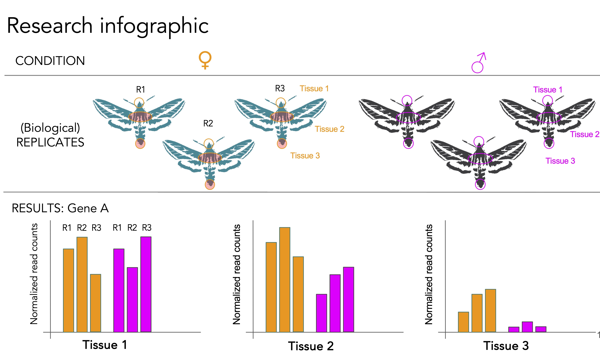

## Differential Gene Expression (DGE)  

<p align="center">

</p> 

Now that we have 
+ (1) gene counts for each set of reads for each sample and 
+ (2) a metadata file that gives us biological conditions (sex, body part) for each sample,  

we can use statistical analyses to ask if particular genes were detected more frequently in certain samples or in certain biological conditions.  

The general structure of this question is:

y ~ sex * body part  

which asks if gene expression (*y*) is determined by (*~*) the interaction of the variables *sex* and *body part*.  
  

### (1) Download R and R studio to run DESeq2 

To analyze DGE, will use a program written in the R language called DESeq2.  

If you want to run this analysis locally on your own computer, you will need to download and install R and the user interface, RStudio.  

+ You can download R here: https://cran.rstudio.com/
+ You can download R studio here: https://rstudio.com/products/rstudio/download/#download

+ [Here are some helpful step-by-step instructions with screenshots from Colorado State University](https://www.stat.colostate.edu/~jah/talks_public_html/isec2020/installRStudio.html) 

This is a useful guide for working in RStudio
+ [Hands-On Programming with R github](https://rstudio-education.github.io/hopr/starting.html)


### (2) Download counts (.tsv) files from HiPer Gator  

At this point everyone needs a copy of all counts files. Download your counts files and share copies with your group members!  

Make a directory on your computer for differential gene analysis (e.g., "DGE_Analysis"). Make a folder within this directory just for your counts.tsv files (e.g., "counts_files"). Put all of your counts files within this folder. **Do not put anything else in this folder**  

Put a copy of your metadata file in .csv format in the parent differential gene expression directory. **Make sure names in the "sample" column of your metadata match the counts file names in your counts directory**  

in unix you can remove a portion of the filename using the following syntax:  
```for f in *_L001.sorted.counts.*; do echo mv -i -- "$f" "${f//_L001.sorted.counts./.}"; done```  
the ```echo``` here will print what it plans to change the file names to. If it is correct, remove the ```echo``` from the line and rerun to actually change the file names. 


### (3) Performing differential gene expression with DESeq2 in R 

Resources:  
+ The original paper by [Love, Huber and Anders (2014)](https://genomebiology.biomedcentral.com/articles/10.1186/s13059-014-0550-8)  
+ The bioconductor page for [DESeq2](https://bioconductor.org/packages/release/bioc/html/DESeq2.html)  
+ [Authors'  step-by-step tutorial](https://bioconductor.org/packages/devel/bioc/vignettes/DESeq2/inst/doc/DESeq2.html)  
 + [Count normalization](https://hbctraining.github.io/DGE_workshop/lessons/02_DGE_count_normalization.html)


<p align="center">
#### Steps in R ###
</p>

<p align="center">

</p> 

#### (1) Read in counts files  
+ Option A: read in folder of counts files in .tsv format and combine in R
+ Option B: combine counts files into single file using Excel or Google Sheets, save as .csv format, then import single file using  ```read.csv``` function

#### (2) Import metadata file into R
The sample names here need to match the column names in your counts file.  

#### (3) Set up DESeq2 model & run statistical analysis  


#### (4) Merge results with functional annotation
